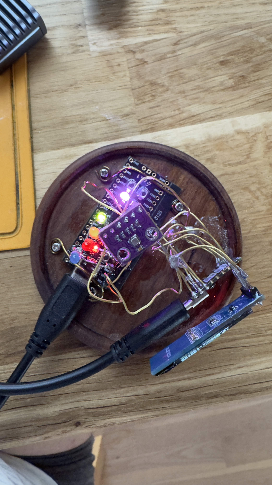
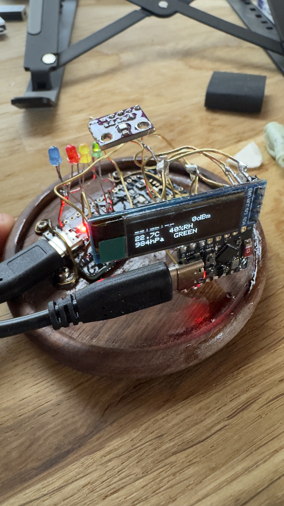
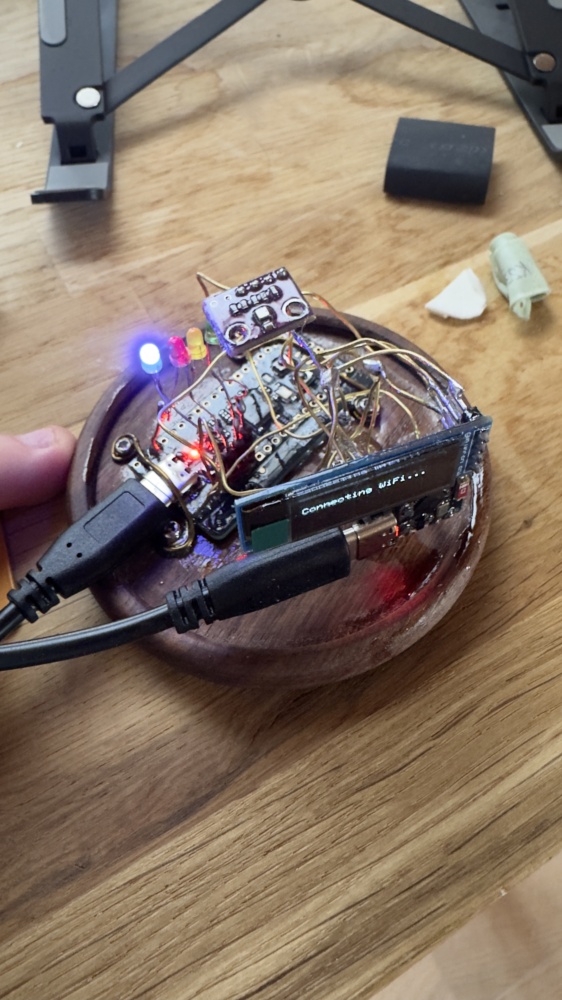
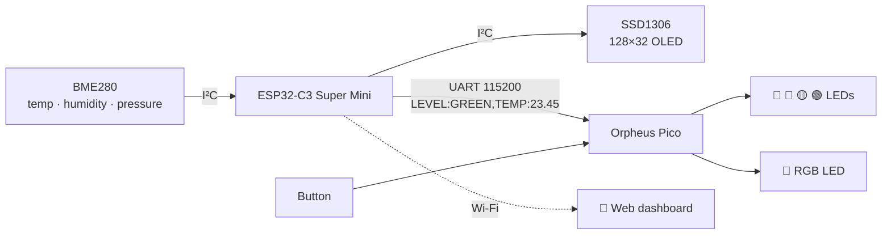

# 🌦️ Weather Station Node

A small desk climate station I built from two microcontrollers that talk over a serial wire.

An **ESP32-C3 Super Mini** reads the room's temperature, humidity and pressure, shows them on a tiny OLED and serves a web dashboard. An **Orpheus Pico** (RP2040) listens on UART at the other end of the wire and turns those numbers into blinking LEDs, so it can tell whether the room is getting too warm without opening anything.

The project is two files, about 540 lines in total, and a lot of jumper wires :D

---

## A look at the build

<table>
  <tr>
    <td width="33%" align="center">
      
      <br />
      <sub><b>01 · The assembled station</b></sub>
    </td>
    <td width="33%" align="center">
      
      <br />
      <sub><b>02 · Live status display</b></sub>
    </td>
    <td width="33%" align="center">
      
      <br />
      <sub><b>03 · Sensor and indicator hardware</b></sub>
    </td>
  </tr>
</table>

---

## How it fits together [(made with this GitHub Doc :)](https://docs.github.com/en/get-started/writing-on-github/working-with-advanced-formatting/creating-diagrams)



The ESP32 does the sensing and networking. Once a second it sends the Pico one line of text:

```
LEVEL:YELLOW,TEMP:26.12
```

The Pico parses that line and drives the LEDs. That's the whole protocol.

---

## What it does

**On the ESP32 (`esp32_firmware.ino`)**
- Reads the BME280 every 2 seconds. If the sensor isn't at `0x76` it tries `0x77`.
- Shows the time, Wi-Fi signal, temperature, humidity, pressure and the current level on the OLED.
- Joins your home Wi-Fi (needs preset up in code at the moement) **and** runs its own hotspot, so the dashboard is always reachable at **http://192.168.4.1**.
- Sets the clock over NTP (the default timezone is CET/CEST).
- Serves a dark-themed dashboard with a live temperature gauge and an editor for the thresholds.
- Saves the thresholds to flash, so they survive a reboot.

**On the Pico (`main.py`)**
- 🔵 **Blue** is a heartbeat and blinks steadily while everything is fine. It blinks **fast** when nothing has arrived from the ESP32 for 10 seconds, which usually means a loose wire or a board that's switched off.
- 🟢 🟡 🔴 Only the LED that matches the current level blinks. All three go dark when the link is down, so a stale reading never looks current.
- 🌈 The button I023 toggles a smooth rainbow animation on the RGB LED. It has no function beyond looking nice.

### Temperature levels

| Level | When | Default |
|---|---|---|
| 🟢 GREEN | below the yellow threshold | < 25.0 °C |
| 🟡 YELLOW | at or above yellow | ≥ 25.0 °C |
| 🔴 RED | at or above red | ≥ 30.0 °C |

You can change both thresholds from the dashboard without reflashing.

---

## Parts list

- ESP32-C3 Super Mini (Tenstar) [Link](https://www.aliexpress.com/w/wholesale-esp32-c3-super-mini.html)
- Orpheus Pico (or any RP2040 board, if you adjust the pins) [Link / Get from Hackclub](https://stardance.hackclub.com/shop/items/138)
- BME280 breakout (I²C) [Link](https://www.aliexpress.com/w/wholesale-bme280-sensor.html)
- SSD1306 OLED, 128×32, I²C [Link](https://de.aliexpress.com/w/wholesale-0%2C91-Zoll-OLED%2525252dDisplay.html)
- 4 × LEDs (blue, red, yellow, green) with 220–330 Ω resistors 
[Link LEDs](https://de.aliexpress.com/w/wholesale-LED%2525252dDioden%2525252dSet-.html)
[Link Resistors](https://de.aliexpress.com/w/wholesale-220–330-Ω-resistors.html)
- 1 × WS2812-style RGB LED (the Orpheus Pico from Hackclub has one on board at GP24) 
- Wires, and ideally a breadboard
- confirmal silicon coating for protection

---

## Wiring

### ESP32-C3

| From | To |
|---|---|
| BME280 + OLED **SDA** | GPIO6 |
| BME280 + OLED **SCL** | GPIO7 |
| BME280 **VCC** | **3.3V** ⚠️ |
| OLED **VCC** | 3.3V (recommended) |
| **TX** GPIO21 | Pico GP1 (RX) |
| **RX** GPIO20 | Pico GP0 (TX) |
| **G** | Pico **GND** |

### Orpheus Pico

| Pin | Connected to |
|---|---|
| GP2 | 🔵 Blue LED |
| GP3 | 🔴 Red LED |
| GP4 | 🟡 Yellow LED |
| GP5 | 🟢 Green LED |
| GP23 | Button (other leg to GND) |
| GP24 | RGB LED |

> [!IMPORTANT]
> **Connect the two boards' grounds.** The UART signal needs a common reference even when each board has its own power supply. Without it you get garbage on the line or nothing at all, and the blue LED blinks fast.

> [!IMPORTANT] 
> **Use a USB-C Splitter cable one female to 2 male for power supply!**

> [!WARNING]
> **Keep the I²C bus at 3.3V.** Many BME280 modules are 3.3V only, and the ESP32-C3's GPIOs are **not** 5V tolerant. If you get "BME280 not found", check first that the sensor's VCC is on the 3.3 pin.

---

## Getting it running

### 1. Flash the ESP32

1. Install the **ESP32 board package** in the Arduino IDE and select an ESP32-C3 board (for example *ESP32C3 Dev Module*). You may need to enable *USB CDC On Boot* to see serial output.
2. Install these **libraries** with the Library Manager:
   - Adafruit BME280 Library
   - Adafruit Unified Sensor
   - Adafruit GFX Library
   - Adafruit SSD1306
3. Open `esp32_firmware.ino` and fill in the config block at the top:
   ```cpp
   const char* WIFI_SSID = "YOUR_WIFI_NAME";
   const char* WIFI_PASS = "YOUR_WIFI_PASSWORD";
   const char* AP_PASS   = "climate123";   // please change this
   ```
4. Upload the sketch and open the Serial Monitor at **115200** baud to see the IP addresses.

### 2. Flash the Pico

1. Put **MicroPython** on the Pico. The `neopixel` module is built in.
2. Open `main.py` in [Thonny](https://thonny.org/) or use **VSCode with extension for RPI Pico** and choose **File → Save As → Raspberry Pi Pico → `main.py`**.
3. Reset the board. It starts automatically from then on.

### 3. Open the dashboard

- Connect to the **`ClimateStation`** Wi-Fi network and go to **http://192.168.4.1**, or
- Use the home-network IP printed on the Serial Monitor.

The page refreshes every 2 seconds.

---

## HTTP endpoints

| Method | Path | What it does |
|---|---|---|
| `GET` | `/` | The dashboard |
| `GET` | `/data` | JSON with the current readings |
| `POST` | `/set-thresholds` | Form fields `yellow` and `red` in °C |

Example `/data` response:

```json
{
  "temp": 23.45, "humidity": 41.20, "pressure": 1013.25,
  "time": "14:32:07", "uptime": "02:11:45", "rssi": -58,
  "level": "GREEN", "threshold_yellow": 25.0, "threshold_red": 30.0
}
```

---

## Troubleshooting

| Symptom | Likely cause |
|---|---|
| 🔵 blinking fast, no coloured LED | No data from the ESP32. Check TX↔RX (they cross over) and the **shared ground**. |
| OLED stays blank | Try address `0x3D` in `OLED_ADDR`. |
| OLED upside down | Change `display.setRotation(2)` to `0`. |
| "BME280 error" on the OLED | Check the sensor's VCC is on 3.3V and SDA/SCL are on GPIO6/7. |
| Clock shows `--:--:--` | Home Wi-Fi didn't connect, so NTP couldn't set the time. The hotspot still works. |
| Wrong time | Adjust `GMT_OFFSET_SEC` and `DST_OFFSET_SEC`. |

---

## A few honest notes

- The dashboard has **no authentication**, so anyone on the same network can change the thresholds. That's fine on a desk, but I wouldn't expose it to the internet, run it **local only**!
- At boot the ESP32 waits up to 20 seconds for Wi-Fi before it starts the main loop (this is also displayed on the OLED Screen).
- If the sensor is missing, `/data` reports zeros rather than errors, and nothing is sent to the Pico. The Pico then shows a lost link (fast blue blinking).

## Ideas for later

- [ ] Log readings and draw a history graph on the dashboard
- [ ] Also flag humidity levels, not only temperature
- [ ] Put a password on the threshold form
      
---
